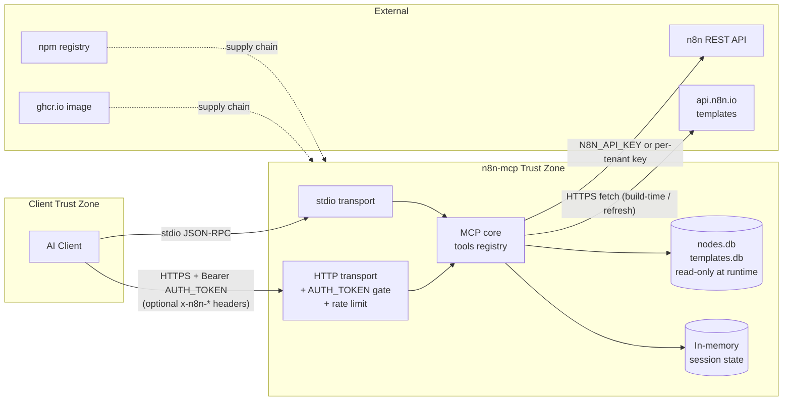

# Threat Model

This document describes the STRIDE threat model for **n8n-mcp**. It is intended for contributors and operators who want to understand the security assumptions the project makes, the trust boundaries it relies on, and the mitigations already in place.

For the disclosure policy, see [`SECURITY.md`](../SECURITY.md). For deployment hardening, see [`SECURITY_HARDENING.md`](./SECURITY_HARDENING.md). For incident handling, see [`.github/INCIDENT_RESPONSE.md`](../.github/INCIDENT_RESPONSE.md).

## 1. Purpose and scope

n8n-mcp is a Model Context Protocol server that gives AI assistants structured access to n8n node documentation and, optionally, management access to an n8n instance via its REST API. This threat model covers:

- The n8n-mcp server itself, in all supported deployment modes (stdio, HTTP single-session, multi-tenant HTTP, Docker image).
- The data flows between AI clients, the server, n8n instances, and the n8n.io templates API.
- The supply chain used to publish the npm package and the `ghcr.io/czlonkowski/n8n-mcp` container image.

It does **not** cover:

- The security of n8n itself. As stated in `SECURITY.md`, "the security boundary is n8n itself, not n8n-mcp" — capabilities reachable through the n8n REST API are not re-evaluated here.
- Generic prompt-injection risk intrinsic to LLMs operating on workflow text. This applies to every MCP server equally.
- The security of the AI client (Claude Desktop, Cursor, Codex, etc.).

## 2. Objectives

The project has three security objectives, in priority order:

1. **Credential hygiene.** A user's `N8N_API_KEY`, HTTP `AUTH_TOKEN`, and any per-tenant credentials must stay inside the trust boundary they were submitted to.
2. **Accurate documentation.** The node/template data served to AI clients must reflect the underlying n8n catalogue without injected content.
3. **Safe defaults.** Out-of-the-box configuration should make the common deployment paths (Claude Desktop + stdio; self-hosted HTTP with `AUTH_TOKEN`) secure by default.

## 3. System decomposition

### 3.1 Actors

| Actor | Description |
|-------|-------------|
| Local developer | Runs the server in stdio mode inside Claude Desktop / Cursor / Codex / VS Code. Shares a process trust boundary with the server. |
| Self-hosted operator | Runs the HTTP server (directly or via Docker) for their own use. Owns the `AUTH_TOKEN` and `N8N_API_KEY`. |
| Multi-tenant tenant | Connects to a shared HTTP deployment and supplies their own n8n credentials per request via headers. |
| AI client | The LLM-driven MCP client that speaks to the server. Treated as a confused-deputy actor — it may act on untrusted workflow text. |
| Downstream n8n instance | Receives REST API calls from the server when management tools are used. |
| n8n.io templates API | Outbound-only source of public workflow templates. |
| External attacker | Unauthenticated network attacker; targets exposed HTTP deployments. |
| Malicious contributor | Submits crafted PRs or takes over a maintainer account (supply-chain). |

### 3.2 Deployment modes

- **stdio** — single process launched by the AI client, communicates over stdin/stdout. No network surface.
- **HTTP single-session** — Express server with a single shared `AUTH_TOKEN`. Session state is in-memory.
- **Multi-tenant HTTP** — Enabled by `ENABLE_MULTI_TENANT=true`. Each request carries the tenant's n8n URL and API key in headers (`x-n8n-url`, `x-n8n-key`, `x-instance-id`, `x-session-id`).
- **Docker image** — `ghcr.io/czlonkowski/n8n-mcp`, runs as a non-root user with the randomized UID/GID created at build time.

### 3.3 Trust boundaries

1. **Process boundary** (stdio) — the AI client and the server share a trust level; anything launching the binary can read `N8N_API_KEY` from the environment.
2. **Network boundary** (HTTP) — the `AUTH_TOKEN` gate is the sole authenticator; everything behind it is in the server's trust zone.
3. **Per-session boundary** (multi-tenant) — the `x-instance-id`/`x-session-id` headers scope session state and the n8n credentials used by that request's tool calls.
4. **Outbound boundary** — calls to the configured n8n REST API and to `api.n8n.io` leave the server's process and are trusted to the extent their TLS endpoints are.

### 3.4 Data-flow diagram

## 4. Assets

| Asset | Sensitivity | Notes |
|-------|-------------|-------|
| `AUTH_TOKEN` | High | Sole gatekeeper for HTTP mode. Generated per deployment (see `SECURITY_HARDENING.md`). |
| `N8N_API_KEY` (and per-tenant equivalents) | High | Grants full workflow and credential read/write on the target n8n. |
| In-memory session state | Medium | Holds per-session context including, in multi-tenant mode, the tenant's n8n credentials for the lifetime of the session. |
| `data/nodes.db` | Low | Public n8n node documentation. No user data. |
| `data/templates.db` | Low | Public n8n.io workflow templates. |
| npm package `n8n-mcp` | High | Downstream users execute it directly; integrity matters. |
| Docker image `ghcr.io/czlonkowski/n8n-mcp` | High | Same — users pull and run it. |

## 5. STRIDE analysis

Each subsection pairs a category of threat with the concrete mitigation that currently addresses it in this codebase. File references are to the current repository layout.

### 5.1 Spoofing

- **Stolen `AUTH_TOKEN` used to impersonate a legitimate HTTP client.** Mitigation: constant-time comparison via `crypto.timingSafeEqual` in `AuthManager.timingSafeCompare` (`src/utils/auth.ts`), IP-based auth-failure rate limit in `src/http-server-single-session.ts`, deployment guidance in `SECURITY_HARDENING.md` recommending `openssl rand -base64 32` and quarterly rotation.
- **Tenant header spoofing in multi-tenant mode.** Mitigation: per-session isolation with null-prototype maps (`src/http-server-single-session.ts` `transports`, `servers`, `sessionMetadata`, `sessionContexts`) and per-request credential binding — no per-tenant key is persisted beyond the session TTL.
- **Impersonation of a trusted MCP client in stdio mode.** Not defended — relies on the process/filesystem trust boundary. This matches the stdio transport's threat model (the caller that launches the server is already trusted).

### 5.2 Tampering

- **Malicious workflow JSON served from `api.n8n.io` templates.** Mitigation: templates are stored as inert data and validated as JSON; they are never `eval`'d, `require`'d, or executed inside n8n-mcp. Any execution happens later on the user's own n8n instance, which is out of scope per `SECURITY.md`.
- **Tampering with `nodes.db` or `templates.db` at rest.** Mitigation: both databases are treated as read-only at runtime (rebuilt via `npm run rebuild`/`npm run fetch:templates`). Docker images bake the database at build time.
- **Man-in-the-middle tampering of n8n REST traffic.** Mitigation: the server always calls n8n over the configured HTTPS URL; certificate validation is left to Node's default TLS stack. `SECURITY_HARDENING.md` warns against using plaintext `http://` targets outside of local development.

### 5.3 Repudiation

- **Denial of having performed a privileged action (HTTP mode).** Mitigation: request and tool-call logging via `src/utils/logger.ts`; HTTP access logs include the session identifier and the tool name so operators can attribute actions.
- **stdio mode has no external audit trail by design** — the transport is local to the caller, who already owns the process. Auditing is delegated to the AI client.

### 5.4 Information disclosure

- **Leakage of `N8N_API_KEY` or `AUTH_TOKEN` via logs or error messages.** Mitigation: errors returned to clients are sanitized before they leave the server; tokens are never interpolated into log output. Operators are reminded in `SECURITY_HARDENING.md` to scope log sinks accordingly.
- **Leakage of secrets embedded in user-authored workflows back to the LLM.** Mitigation: `src/services/credential-scanner.ts` inspects workflows for hardcoded secrets as part of `n8n_audit_instance` and surfaces them as findings rather than silently echoing them.
- **Disclosure of internal state via verbose stack traces.** Mitigation: handler-level try/catch wrappers convert server-side exceptions into sanitized MCP errors; stack traces are kept in logs, not responses.

### 5.5 Denial of service

- **Brute-force of the HTTP auth endpoint.** Mitigation: `express-rate-limit` limiter applied at the auth endpoint in `src/http-server-single-session.ts`, with `RateLimit-*` headers enabled.
- **Unbounded session growth in multi-tenant mode.** Mitigation: configurable `N8N_MCP_MAX_SESSIONS` cap and a periodic cleanup of idle sessions after `SESSION_TIMEOUT_MINUTES`.
- **Abuse of outbound template fetching.** Mitigation: template fetches happen during rebuilds, not on every request, and respect the n8n.io API's rate limits.

### 5.6 Elevation of privilege

- **Cross-tenant bleed in multi-tenant HTTP deployments.** Mitigation: session-scoped maps use `Object.create(null)` to avoid prototype-pollution pitfalls; each session resolves its n8n credentials from its own headers at request time rather than sharing a global `N8N_API_KEY`.
- **Prototype-pollution escalation through crafted payloads.** Mitigation: the null-prototype maps referenced above plus Zod schema validation on configuration inputs (see `src/config/n8n-api.ts`).
- **Container escape to the host.** Mitigation: the published Docker image runs as a non-root user created with a randomized UID/GID at build time; `Dockerfile` explicitly drops privileges before `CMD`.
- **Capability amplification on the downstream n8n (e.g., Code node execution).** Explicitly out of scope per `SECURITY.md` — n8n-mcp grants no capability the caller does not already have on the n8n REST API.

## 6. Open-source / library-specific threats

These threats target the project itself rather than any one deployment.

- **Maintainer account takeover.** Mitigated by 2FA on the maintainer account, branch protection on `main`, and required review for all PRs.
- **Malicious contributor building trust over time.** Mitigated by code review, a single-maintainer merge policy, and signed tags on releases.
- **Typosquatting of the npm package name.** Mitigated by publishing under a scoped, well-known name; downstream users are encouraged to pin by version or integrity hash.
- **Compromise of a transitive dependency.** Mitigated by Dependabot alerts, a committed lockfile, and `npm audit` in CI.
- **Release-pipeline compromise.** Mitigated by running publishes from GitHub-hosted runners with the minimum scopes required for npm and ghcr, and by gating releases on the green CI suite.

## 7. Top-level risks and the controls that address them

| Asset | Primary control |
|-------|-----------------|
| `AUTH_TOKEN` | Constant-time comparison, auth-endpoint rate limit, deployment guide mandates rotation. |
| `N8N_API_KEY` (and per-tenant equivalents) | Never persisted to disk; scoped to the request/session; sanitized out of logs and error responses. |
| Multi-tenant isolation | Per-session state, null-prototype maps, header-derived credentials, session TTL and cap. |
| Supply chain (npm + ghcr) | Locked dependencies, CI-gated releases, signed tags, non-root container user. |

## 8. Review triggers

This threat model is re-reviewed when any of the following happens:

- A new MCP tool is added that mutates state on the downstream n8n.
- A new deployment mode or transport is added (e.g., OAuth, WebSocket, a hosted variant).
- A major version is cut.
- A new class of credential enters the system.
- Otherwise, at least once per calendar year.

## 9. References

- [`SECURITY.md`](../SECURITY.md) — disclosure policy and in-scope/out-of-scope definition.
- [`docs/SECURITY_HARDENING.md`](./SECURITY_HARDENING.md) — deployment hardening knobs.
- [`.github/INCIDENT_RESPONSE.md`](../.github/INCIDENT_RESPONSE.md) — incident handling process.
- Microsoft STRIDE reference: <https://learn.microsoft.com/en-us/azure/security/develop/threat-modeling-tool-threats>.
